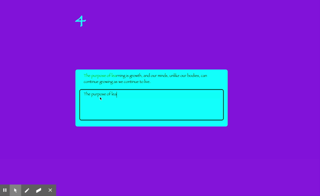

# Speed Typing Game

[a link](https://github.com/user/repo/blob/branch/other_file.md)

## Introduction

> Test your speed when it comes to your typing skills. This is an easy and fun game to see how fast you can type and see how many mistakes you make if any.

## Code Samples

> function getRandomQuote() {

    return fetch(RANDOM_QUOTE_API_URL)
        .then(response => response.json())
        .then(data => data.content)
}

## Troubleshooting

> Had issues finding an API
> Getting the letters to show red when the user type in the incorrect letter.

## Installation

> Pure javascript and html was used in making this game. I used an API that generates random quotes.

